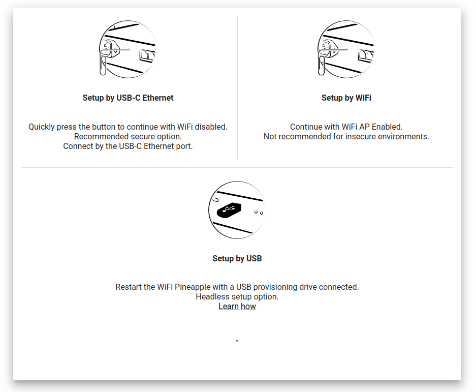

# Setting up your WiFi Pineapple

Once you've connected to the WiFi Pineapple and it has fully booted, you will be able to access the WiFi Pineapple Stager at http://172.16.42.1.

The WiFi Pineapple ships with a slimmed down firmware called **the stager**. This approach enables you to always have the latest firmware for the out-of-the-box set-up, due to the latest firmware being downloaded.

## Getting the latest firmware via Over-The-Air

To start, begin by verifying that you are in the presence of the WiFi Pineapple. You can do this by pressing the reset button in one of the ways described on-screen.


Continuing withing the **Setup by USB-C Ethernet** option will still allow you to use WiFi to connect to a network and download the firmware.


Next, connect to an Access Point you know the credentials to. Doing this will establish an internet connection for the WiFi Pineapple, and the latest firmware will be automatically downloaded.

.png>)


Only WPA2, WPA and Open networks are currently supported in the stager.


After the connection is successfully established, the firmware will be automatically downloaded and flashed to your WiFi Pineapple. Once the upgrade is complete, you will be able to access the WiFi Pineapple at https://172.16.42.1:1471 again.

.png>)

## Uploading the firmware manually

As an alternative to getting the firmware over-the-air, you may choose to upload the firmware to the WiFi Pineapple manually. This can be useful if you are having difficulties connecting to an Access Point, or if you don't have one available.

To start, begin by downloading the latest firmware from the [Hak5 Download Portal](htps://downloads.hak5.org). The latest releases are always at the top of the table, and highlighted blue.

.png>)

Once the file is downloaded, verify the SHA256 sum with the one listed on the download portal.


If the SHA256 sum of the downloaded file does not match the one listed on the website, do not upload it to the WiFi Pineapple, as it may be corrupted.


Next, you can upload it to the WiFi Pineapple by clicking the **upload a firmware instead** link on the Network page.

.png>)

After uploading, the file will be checked and flashed to the WiFi Pineapple.
