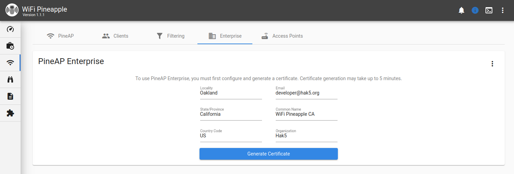

# PineAP

## PineAP Settings

The main PineAP page is used to manage the PineAP Daemon settings and status. You can manage individual daemon settings by selecting the **Advanced** tab, or you may select preset settings with the Passive or Active tabs.

On the right hand side, you can find the current SSID pool. These SSIDs can be automatically collected in the Passive and Active modes, or by selecting the "Capture SSIDs to Pool" option in Advanced. You can use the field below and the Add, Remove and Clear buttons to manually add or remove SSIDs.

## Clients

The clients page provides two views for clients, split into connected clients and previous clients. From the **Connected Clients** you can view information about each connected client, including MAC, IP Address and the SSID they associated to, as well as the ability to kick them from the network.

Switching to the **Previous Clients** tab shows you a record of all previous associations to the rogue access points hosted by the WiFi Pineapple. Clients that have not yet disconnected from the network have a disconnect time of "Unavailable".

## Filtering

The filtering page allows you to have fine control over what devices can connect to your WiFi Pineapple. You can do this by combining two filters: the **Client Filter** and the **SSID Filter**, with two modes each: **Allow** or **Deny**.

With the client filter you may limit the scope of engagement by choosing what devices may connect. Allow only specific devices, or any device that isn't specifically on the deny list.

With the SSID filter you may specify the spoofed networks for which the WiFi Pineapple will allow associations. Allow associations for only specifically listed SSIDs, or any SSID that isn't specifically listed.

## Enterprise

The **Enterprise** tab allows you to configure a WPA-EAP Enterprise rogue access point. To begin, fill in the form to generate the EAP configuration and certificates.

Once the certificate has been generated, you'll see easy to use options to configure the rogue enterprise access point, and view the challenge data any connected clients provide.

## Access Points

The **Access Points** tab allows you to configure the other access points hosted on the WiFi Pineapple: The **Management AP**, **Open AP**, and **Evil WPA/2 AP**.

